# AI原生产品交互范式白皮书

**从操作到意图，从工具到智能协作**

> **AI-NATIVE PRODUCT INTERACTION**
> *A Paradigm for Human–AI Product Design*

**版本：V1.2**

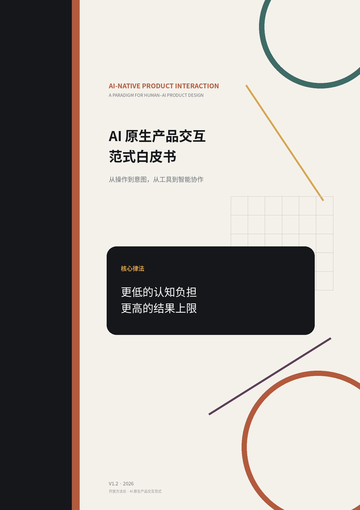

---

## 目录

- [前言与范围](#前言与范围)
- [AI 原生产品交互第一性原则](#ai-原生产品交互第一性原则)
- [01｜为什么现在必须重写产品设计](#01为什么现在必须重写产品设计)
- [02｜第一律](#02第一律)
- [03｜从功能到意图与责任](#03从功能到意图与责任)
- [04｜引导式收敛](#04引导式收敛)
- [05｜自主工作与判断流](#05自主工作与判断流)
- [06｜预测、学习与进化](#06预测学习与进化)
- [07｜十二条设计原则](#07十二条设计原则)
- [08｜设计评审与反模式](#08设计评审与反模式)
- [前人的肩膀](#前人的肩膀这套范式与既有思想的关系)
- [结语](#结语ai-时代让产品适应人而不是让人适应产品)
- [参考文献与延伸阅读](#参考文献与延伸阅读)

---

# 前言与范围

本白皮书讨论的是：当 AI 成为产品核心运行能力后，具有持续“人—AI”交互闭环的数字产品，应该如何重新设计。

<table>
<colgroup>
<col style="width: 100%" />
</colgroup>
<thead>
<tr class="header">
<th>
<strong>核心定义</strong>

AI 原生产品交互范式，是一种以用户真实意图为起点，以 AI
的理解、推理、预测、学习、生成与自主执行能力为基础，重新设计人与产品之间目标理解、责任分配、判断、协作与行动关系的交互范式。

关键不在于“是否用了 AI”，而在于是否按照 AI
已经能够承担认知与执行工作的前提，重新设计人与产品之间的关系。
</th>
</tr>
</thead>
<tbody>
</tbody>
</table>

**适用范围**

| **核心适用** | AI SaaS、AI Agent、AI 创作与编程工具、AI 教育、AI 金融、AI 企业软件、AI 操作系统与智能数字服务等——其核心体验存在持续的人—AI 认知交互闭环。                                              |
|--------------|-----------------------------------------------------------------------------------------------------------------------------------------------------------------------------------------|
| **扩展适用** | 智能汽车、机器人、AI 眼镜、智能终端等。只要 AI 进入最终用户体验并参与持续理解、判断、适配与行动，本框架具有参考价值；V1 系列暂不展开物理安全、空间交互等专门问题。                      |
| **不在范围** | 仅在研发、生产、供应链或营销环节使用 AI，而最终产品本身不具备 AI 交互闭环的食品、普通硬件、传统工业品等；也不讨论“如何用 AI 帮产品经理写 PRD / 做研发”的 AI-assisted Development 方法。 |

**避免误读**

<table>
<colgroup>
<col style="width: 100%" />
</colgroup>
<thead>
<tr class="header">
<th><strong>AI-assisted Development</strong>：AI
帮团队开发产品——不是本白皮书主题。 
<strong>AI-powered Feature</strong>：旧产品中的局部 AI
功能——原则可部分参考。 
<strong>AI-native Product Interaction</strong>：围绕 AI
能力重新设计人与产品之间的意图、责任、判断与协作——这是本白皮书的核心讨论对象。</th>
</tr>
</thead>
<tbody>
</tbody>
</table>

**一句话边界：本白皮书研究的是“当 AI 成为产品核心能力后，人应该如何与产品交互”，不是“如何使用 AI 来设计产品”。**

# AI 原生产品交互第一性原则

<table>
<colgroup>
<col style="width: 50%" />
<col style="width: 50%" />
</colgroup>
<thead>
<tr class="header">
<th></th>
<th>
<strong> 
更低的认知负担，</strong>

<strong>更高的结果上限。</strong>
</th>
</tr>
</thead>
<tbody>
</tbody>
</table>

AI 带给产品交互最根本的机会，不只是把旧流程自动化，也不只是把一个聊天框、Copilot 或 Agent 嵌进已有软件。真正的变化，是产品第一次能够持续理解人的意图、承担专业推理、预测需求、学习偏好，并自主完成大量原本必须由用户亲自组织和操作的工作。

因此，AI 时代产品交互设计的一级对象需要发生迁移：从“有哪些功能、页面和流程”，转向“用户真正要实现什么、哪些判断只有用户能够做、哪些认知与执行责任应当由 AI 承担”。功能、页面和流程仍然存在，但它们不再天然是产品的骨架，而越来越像围绕目标动态组织出来的能力表现。

本白皮书提出一套 AI 原生产品交互范式：以元价值和目标作为锚点，通过专业框架驱动的引导式收敛，把用户能够感知却难以专业表达的隐性意图转译为 AI 可以准确行动的可执行意图；AI 承担专业决策与执行，人从持续操作者升级为关键节点的价值判断者；产品通过预测、学习与进化，持续降低无效交互，并不断把用户带向超越既有经验与行业惯性的更高结果上限。

<table>
<colgroup>
<col style="width: 100%" />
</colgroup>
<thead>
<tr class="header">
<th><strong>这不是一份“AI 功能清单” 
</strong>它讨论的是：当 AI
成为产品核心能力后，人和产品之间的交互关系应该怎样变化。它面向未来的长期方向，不把今天模型的暂时缺陷写成永久交互原则。</th>
</tr>
</thead>
<tbody>
</tbody>
</table>

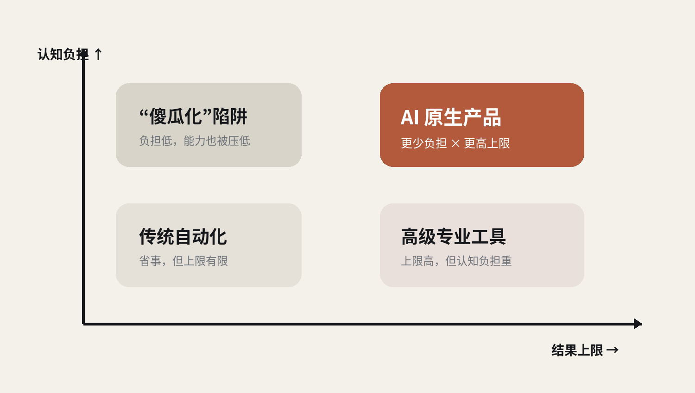

图 1｜AI 原生的目标：同时向“更低认知负担”和“更高结果上限”移动。

## 白皮书的立场

> 在本白皮书定义的交互型数字产品范围内，AI
> 原生不是一种狭窄的产品类别，而是使用 AI
> 能力的产品将逐步走向的设计方向。
>
> 产品交互范式应面向 AI 能力的长期方向；工程设计负责解决当前 AI
> 能力与理想范式之间的差距。
>
> 用户不应被要求承担本应由 AI 完成的专业判断；AI
> 也不应越过只有用户才有资格做出的价值判断。
>
> 真正优秀的 AI
> 产品，不只越来越懂用户，还应持续吸收最新专业能力，为用户呈现超越既有经验的更优可能。

# 01｜为什么现在必须重写产品设计

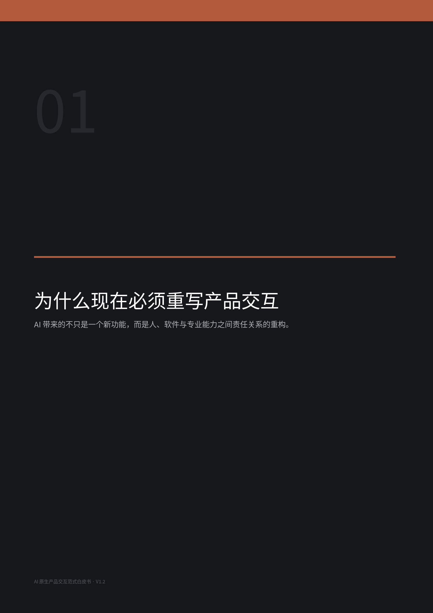

## 1.1 软件史的惯性：我们仍在设计“需要人操作的机器”

GUI、Web、Mobile、SaaS 的共同基础，是人负责理解目标、拆解任务、选择方法并驱动软件完成操作。每一次交互革命都降低了一部分操作成本，却很少改变最根本的责任分配：软件提供能力，人负责思考如何使用这些能力。

于是今天大量 AI 产品仍沿用旧结构：原来的 Dashboard 上增加一个“AI 助手”，原来的编辑器旁增加一个 Prompt 面板，原来的工作流加一个 Agent 按钮。AI 的能力被塞进旧容器，用户仍需要理解参数、组织步骤、决定技术路径，甚至学习怎样“正确地和 AI 说话”。

|     | **如果用户必须先成为半个导演、半个程序员、半个数据分析师，才能用好 AI，那么产品只是把模型能力暴露出来，并没有真正完成 AI 原生设计。** |
|-----|---------------------------------------------------------------------------------------------------------------------------------------|

## 1.2 Chat 不是终极界面

自然语言极大扩展了表达自由，但一个空白输入框也把巨大的搜索空间交给了用户。用户需要自己决定该说什么、说到多细、哪些信息重要、怎样纠正系统。表达能力无限，并不等于认知成本最低。

2025 年关于 Generative Interfaces 的研究已经指出，线性的请求—响应对话在信息密集、多轮探索任务中存在效率限制；动态生成任务相关界面，在多类任务上获得了更高的人类偏好。[7] Google 对偏好获取与澄清问题的研究也持续指向同一个事实：系统需要学会主动提出能够减少不确定性的高价值问题，而不能把所有意图显化责任交给用户。[8][9]

## 1.3 Agent 也不是终点

Agent 把“执行”向 AI 推进了一大步，但很多 Agent 产品仍假设用户已经拥有清晰目标：用户给 Goal，AI 做 Plan，再执行 Action。真实世界并不总是这样。人的意图经常是模糊的、感性的、难以专业表达的，甚至需要在看到候选结果之后才逐渐意识到自己真正要什么。

因此，AI 原生产品的关键能力不能止于“替用户执行”，还必须能够帮助用户发现目标、显化偏好、理解认知冲突，并在目标足够清晰后承担专业决策。

## 1.4 这套范式站在哪些“巨人肩膀”上

这套框架并非否认既有研究。相反，它建立在多个已经成熟或正在加速发展的思想基础上：Mixed-Initiative Interaction 早在 1999 年就提出人和计算机应在合适的时机各自承担最擅长的部分；Microsoft 2019 年的 Human-AI Interaction Guidelines 系统总结了上下文行动、纠错、解释、学习与长期适应等 18 条原则；偏好获取、主动提问、视觉个性化、Generative UI 等研究也分别解决了这一拼图的不同部分。[1][2][3][4][7][8]

本白皮书的增量不在于声称这些零件从未存在，而在于将它们重新组织成一个面向 AI 时代产品交互的统一责任模型：以“更低认知负担、更高结果上限”为最高律法，从功能设计转向目标与责任设计，把引导式收敛、判断流、可观察自主、预测准备、双向学习和持续超越放进同一套交互范式。

# 02｜第一律

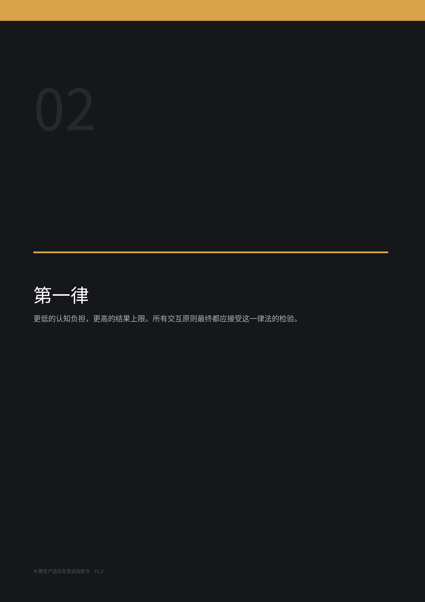

## 2.1 第一律：同时优化两个方向

AI 原生产品的价值不应仅用“自动化了多少步骤”或“模型多聪明”衡量。真正重要的是：为了获得理想结果，人需要承担多少认知负担；以及产品最终能够帮助人达到怎样的结果上限。

|     | **只有降低负担，没有提高上限，是自动化；只有提高上限，却要求用户掌握大量专业知识，是高级工具；同时降低认知负担并提高结果上限，才是 AI 原生设计真正的跃迁。** |
|-----|--------------------------------------------------------------------------------------------------------------------------------------------------------------|

## 2.2 认知负担不是“交互次数”

“更低认知负担”不等于“越少交互越好”。一次高价值的对比选择，可能避免半小时 Prompt Engineering 和五轮返工。应当减少的是无效认知负担：专业术语学习、无意义配置、重复表达、实现细节选择、产品操作记忆、无必要确认，以及用户自己组织复杂工作流的负担。

相反，高价值判断应当被保留甚至强化：我真正要什么？哪个更像我的决定？哪种权衡我愿意接受？这个方向是否背离了最初的价值？人不是少思考，而是把思考集中在只有人最有资格判断的事情上。

## 2.3 结果更优的上限不是“更复杂”

提高结果上限不意味着把更多高级功能暴露给用户。真正的结果上限来自 AI 对最新专业知识、最佳实践、工具能力和用户个体差异的综合利用。理想状态不是让普通用户学会像专家一样操作软件，而是让产品把专家能力内化，使普通用户能够获得过去只有专家才有机会达到的结果。

# 03｜从功能到意图与责任

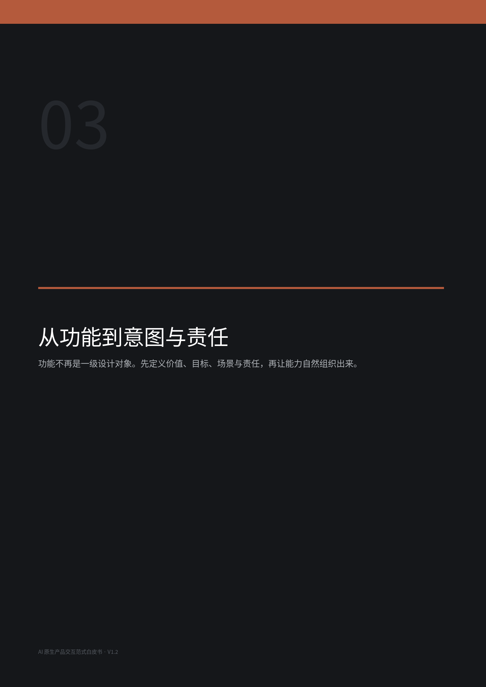

## 3.1 从“功能设计”转向“目标与责任设计”

传统产品经理习惯从“这个产品应该有哪些功能”开始。AI 原生设计的第一组问题应提前到功能之前：为什么做？为谁做？在什么场景？用户最终希望发生什么改变？哪些判断只有用户能做？哪些工作 AI 应该全部承担？

由此，功能不再天然是一级设计对象。它可以是围绕当前用户、目标和场景动态组织出来的能力组合；流程也不一定是固定流程，它可以由 AI 根据上下文、约束与反馈实时生成；页面甚至可能逐渐从稳定的信息架构单位，变成自适应的交互表面。

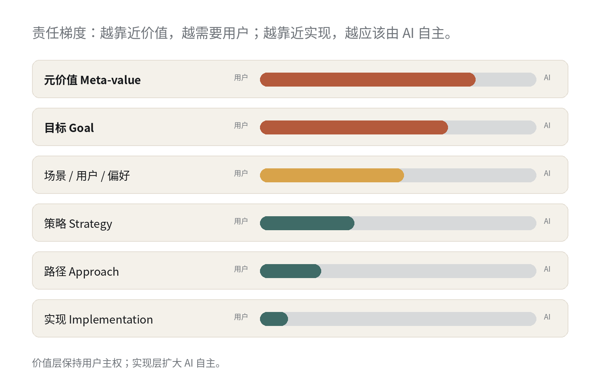

图 2｜责任梯度：价值层保持用户主权，实现层扩大 AI 自主。

## 3.2 元价值是锚点，路径不是目标

用户在描述需求时，经常把目标和路径混在一起。比如“必须用微服务”“一定要做 App”“我要一个聊天机器人”。这些表达可能只是用户当下能想到的实现方式，而不一定是他真正要达到的目标。

AI 原生产品需要识别需求层级：元价值决定“为什么值得做”；目标决定“要得到什么”；场景、用户与偏好决定“对谁、在什么场景下体验最好”；策略和路径决定“怎样实现”；技术实现则应服从当前最新的专业最优解。

<table>
<colgroup>
<col style="width: 100%" />
</colgroup>
<thead>
<tr class="header">
<th><strong>层级稳定性 
</strong>越靠近元价值，修改阈值越高；越靠近实现手段，AI
自主调整频率越高。大量所谓“需求变化”，其实只是策略、路径和实现手段在变化。</th>
</tr>
</thead>
<tbody>
</tbody>
</table>

## 3.3 决策归属：问题要交给真正拥有答案的人

AI 产品交互设计最常见的错误之一，是把专业实现问题重新扔给用户：用 React 还是 Vue？PostgreSQL 还是 MySQL？REST 还是 GraphQL？如果这些问题能够由 AI 根据用户场景、目标、团队、成本和约束推导出更优方案，就不应该成为用户交互的重心，甚至不应该问。

用户天然拥有答案的是价值、目标、场景、使用者、偏好与权衡；AI 应承担的是专业方案、技术路径、工具选择、参数和当前最佳实践。现实约束如预算、法规、既有系统和不可逆条件，则作为优化边界进入 AI 的决策模型。

|     | **问题应该问给真正拥有答案的人。不要把 AI 本应承担的专业推理责任，以“给用户选择”的名义退回给用户。** |
|-----|------------------------------------------------------------------------------------------------------|

## 3.4 选择必要性门控

“有多个方案”并不意味着“应该让用户选”。每一次选择都应先通过三个问题：是否存在明确的专业最优解？如果没有，差异是否涉及只有用户才能定义的价值、体验、表达或权衡？这个差异是否会实质影响最终结果？

如果 AI 已经有足够信息判断 A 明显优于 B，就直接决定；如果两个方案都专业成立，而差异在于“更自由还是更简单”“更先锋还是更大众”“更便宜还是体验更好”，才把判断交给用户。用户选择应当是一种稀缺资源。

# 04｜引导式收敛

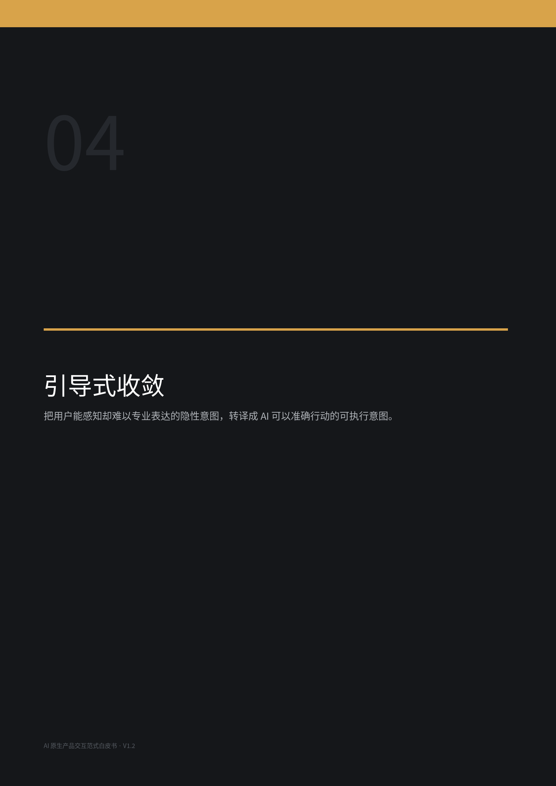

## 4.1 用户知道要什么，但不懂用专业语言表达

大量真实需求并非不存在，而是无法被用户准确编码成专业表达。用户会说“这个太 AI 了”“我想高级一点”“这个不像我”“我喜欢左边的光线，但右边的人物更符合我的要求”。传统产品把这种模糊当成输入缺陷，要求用户补充更多参数。AI 原生产品应把模糊视为正常的人类初始状态。

因此，产品的任务不是逼用户学会专业语言，而是通过专业引导和用户可视化的方案选择，把隐性的感知和价值逐步外显成 AI 可理解、可行动的意图。

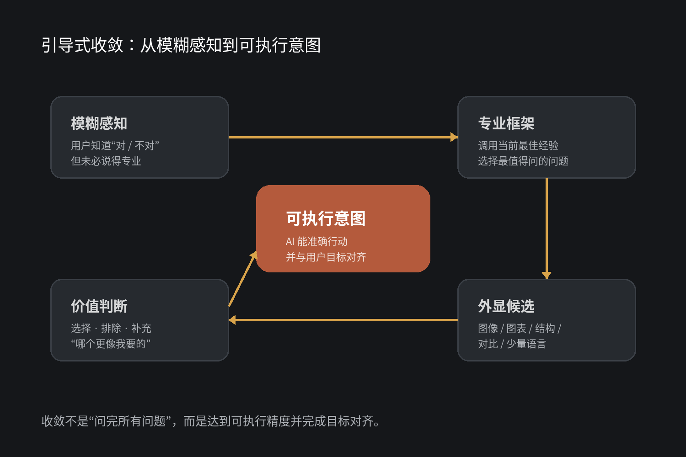

图 3｜引导式收敛：从模糊感知到可执行意图。

## 4.2 可视化是信息可视化，不是“多放图片”

用户最理想的交互状态，是在可感知、可比较的外部表示中进行选择和补充描述。这里的“可视化”是信息可视化概念：图像、图表、结构图、流程图、色卡、时间轴、状态图、关系网络、路径分叉、对比卡片都可以成为意图显化媒介。

真正的原则不是“可视化越多越好”，而是选择让用户认知成本最低的表达媒介。两句话最清楚就用两句话；差异必须通过结构图才能被看见，就生成结构图；视觉风格难以言说，就让用户直接比较图像。

|     | **能让用户看见并判断的，就不要求用户描述；能由 AI 推断的，就不要让用户配置。** |
|-----|--------------------------------------------------------------------------------|

## 4.3 专业框架驱动的共同发现

初始化不应是一份静态问卷，也不应是一棵固定问题树。理想系统维护的是持续更新的专业认知框架：基于当前人类已知的最前沿有效经验，根据用户每次反馈动态选择下一次最有价值的提问或呈现方式，帮助双方共同发现并确认真正的元价值、目标、场景和偏好。

这要求产品把领域专业性“吃进去”。用户不需要知道系统此刻调用了设计思维、行为科学、战略分析还是某个行业方法论；专业性最终只应表现为：系统能问对问题，而且问题越来越少、越来越准。

## 4.4 收敛的终点：可执行精度 + 用户设计思想的对齐

收敛完成不意味着“所有变量都问清楚”。只要剩余不确定性已经不会实质影响目标实现，继续提问就是额外负担。正确的结束条件是：AI 已经形成自己认为可以准确实现的目标理解，并以用户容易判断的方式重新呈现；用户确认“对，这就是我要的”，随后系统进入执行。

|     | **够做对，就不要再追问。** |
|-----|----------------------------|

## 4.5 反思性透明：AI 要有能力帮助用户看清自己

当用户的显性表达、连续选择和已确认元价值出现具有决策意义的矛盾时，AI 不应静默替用户选择“哪个才是真实偏好”，也不应机械服从文字声明。它应把观察到的矛盾、判断依据和可能解释显性化，让用户理解自己的认知偏差并重新确认。

这种透明不等于暴露模型内部推理链，而是呈现可验证的判断依据：你说你要“极简”，但最近八次选择中有七次偏向更高信息密度；我目前有两个解释——你追求的是视觉克制，或你希望界面简单但不愿牺牲控制能力。哪一个更接近？

# 05｜自主工作与判断流

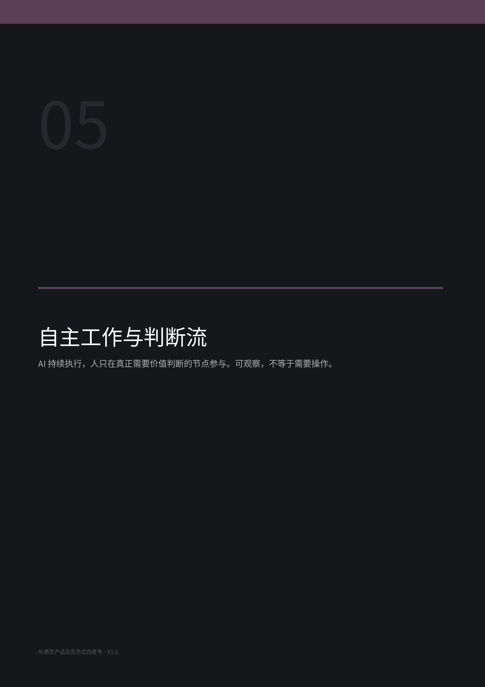

## 5.1 人的角色：从持续操作者到持续判断者

AI 原生工作流中，大部分专业工作由 AI 自动完成。人的参与不会消失，但角色发生改变：从不断点击、输入、配置、拖动、选择技术方案，升级为在关键节点提供价值判断。

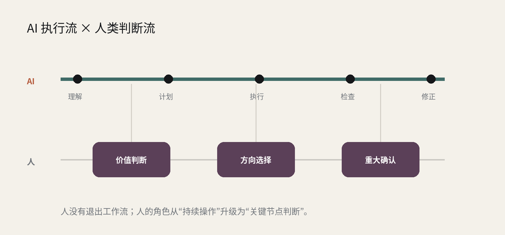

图 4｜Judgment Stream：AI 持续执行，人只在关键节点提供高价值判断。

这种“判断流”与传统操作流有本质差异。一个用户一天可能只做十几次判断，但每一次都是只有他才有资格决定的事情；其余成百上千次与实现有关的专业判断，由 AI 自己完成。AI 的价值不是让人完全退出，而是把人的注意力从低价值操作释放出来。

## 5.2 可观察的自主，而不是黑箱 Agent

传统软件把所有控制暴露给用户；某些 Agent 产品走向另一个极端——什么都不让用户看，只在任务结束后交付结果。AI 原生设计应建立第三种状态：执行权交给 AI，理解权仍然属于用户。

系统的工作过程应当持续外显：当前目标、阶段、正在处理什么、完成度、哪些决策已自主完成、哪些节点等待判断、为什么发生重大调整。用户可以随时理解项目状态，却不需要亲自管理每一步。

<table>
<colgroup>
<col style="width: 50%" />
<col style="width: 50%" />
</colgroup>
<thead>
<tr class="header">
<th></th>
<th>
<strong>可观察，不等于需要操作；</strong>

<strong>自主执行，不等于黑箱操作。</strong>
</th>
</tr>
</thead>
<tbody>
</tbody>
</table>

## 5.3 持续对齐：元价值稳定，路径动态进化

真正稳定的不是每一个早期需求，而是初始化阶段共同发现并确认的元价值与核心目标。策略、路径和实现手段可以随着新信息持续调整。AI 应在后台以元价值和目标约束自己的自主工作，而不是反复打断用户确认“你的目标还是这个吗”。

如果出现显著冲突，系统应把最初的价值锚点与当前行为所指向的新方向并列呈现，让用户重新想起“从哪里出发、要到哪里去”，再给出最新答案。对齐的目的不是把用户拉回旧目标，而是确保 AI 当下理解与用户真实意图仍然一致。

## 5.4 分歧要“结果化”，而不是“辩论化”

当 AI 判断用户当前选择可能伤害已确认的元价值或目标时，理想兜底不是和用户争论，而是把不同选择会带来的结果分歧说明白：按当前选择继续会得到什么，按原目标继续会得到什么，主要差异和成本在哪里。最终决定权仍由用户掌握。

AI 的干预深度可以像 Agent 授权等级一样分级：跟随、提醒、审慎、守护。但在良好的初始化和责任分配下，严重冲突本应是低频异常，而不是日常交互的常态。

# 06｜预测、学习与进化

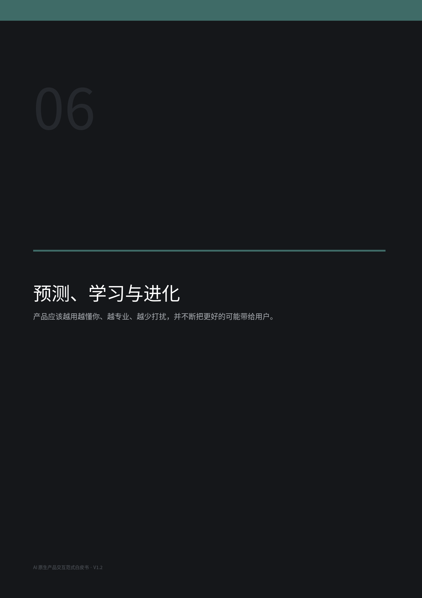

## 6.1 预测能力：产品开始提前适配，而不只是响应

传统产品响应用户行为；AI 原生产品应根据上下文、历史行为、当前目标与使用习惯，预测用户下一步最可能需要什么，并提前改变自己的呈现与准备状态。

预测可以表现为动态调整 UI 布局与信息密度、把高概率入口前置、准备下一个任务所需资料、提前生成候选方案、缓存资源、估算成本与风险。用户感受到的不是“AI 又弹出来告诉我它预测了什么”，而是“我正准备做这个，它已经准备好了”。

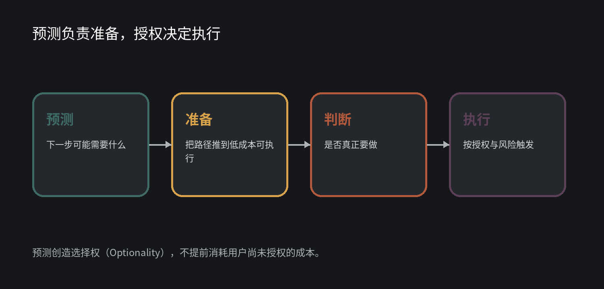

图 5｜预测创造选择权：提前准备，不越权执行。

|     | **预测负责把路铺好，不负责替用户出发。** |
|-----|------------------------------------------|

## 6.2 预测和执行必须解耦

即使 AI 判断某个行为有 90% 概率会发生，也不代表应该直接做掉，因为执行可能产生成本、外部影响或不可逆后果。预测的职责是把未来可能需要的行动推进到低等待、低摩擦、可立即执行的状态；真正执行则由授权等级、风险、可逆性和现实成本决定。

零成本、低风险、完全可逆的界面适配可以直接发生；有计算或资源成本但尚未产生外部承诺的行为，可以进入“准备态”；付款、发布、删除、签约、创建收费资源等行为不能仅凭预测触发。

## 6.3 学习进化：产品应该越用越聪明、越少打扰

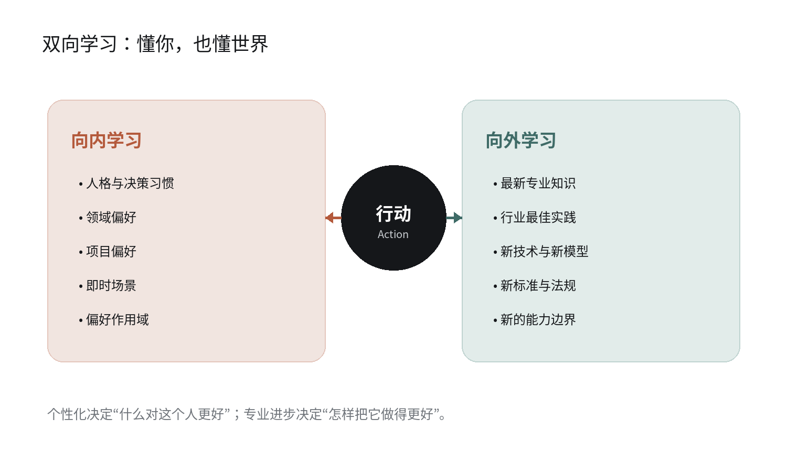

图 6｜双向进化：向内学习用户，向外学习世界。

学习有两个方向。向内，系统持续理解用户的人格、领域偏好、项目偏好、即时场景和决策习惯；向外，系统持续吸收最新专业知识、行业最佳实践、新技术、新模型、新标准和新的能力边界。两套学习不能互相污染。

|     | **用户偏好决定“什么对这个人更好”；专业进步决定“怎样把它做得更好”。** |
|-----|----------------------------------------------------------------------|

## 6.4 偏好有作用域，不是简单的“长期/短期记忆”

同一个人的偏好天然有不同生命周期：稳定人格特质可以跨项目继承；某个领域的偏好只在对应领域生效；项目偏好随项目生命周期存在；即时状态则快速衰减。信息应该活多久，是它的语义属性决定的，而不是开发者提前规定一个统一的记忆时长。

好的个性化不取决于 AI 记住多少，而取决于它是否知道每一种记忆应该在何时、何地、以多大权重生效。把“这次想要黑白风格”学成“这个人永远喜欢黑白”，与完全不学习一样，都是失败的典型。

## 6.5 失败学习与偏好学习必须隔离

用户否决 AI 的结果，系统不能直接把它记成“AI 做错了”。客观失败应进入系统能力学习：修正知识、策略或工具选择；个人偏好应更新用户模型；场景性偏好只更新当前领域或项目；如果是目标理解错误，则重新对齐。

|     | **现实告诉 AI“你错了”，和这个用户告诉 AI“我选择其他”，不能进入同一个学习回路。** |
|-----|----------------------------------------------------------------------------------|

## 6.6 持续超越：个性化不是把用户困在过去

如果系统只是学习用户过去喜欢什么，然后永远重复这些选择，它最终只是更高级的推荐算法。AI 原生产品应建立在持续追逐卓越的条件上：历史偏好是先验，不是上限。

当 AI 基于当前元价值、目标、新知识和新能力，发现一个明显优于用户既有偏好的新可能时，应当有责任把它呈现出来。个性化负责“懂你”，超越性负责“不把你锁在过去的你”。不同产品中“更优”的含义会不同，创作型产品尤其需要尊重表达主权；本白皮书不进一步建立品类分类学，只保留这一上位原则。

# 07｜十二条设计原则

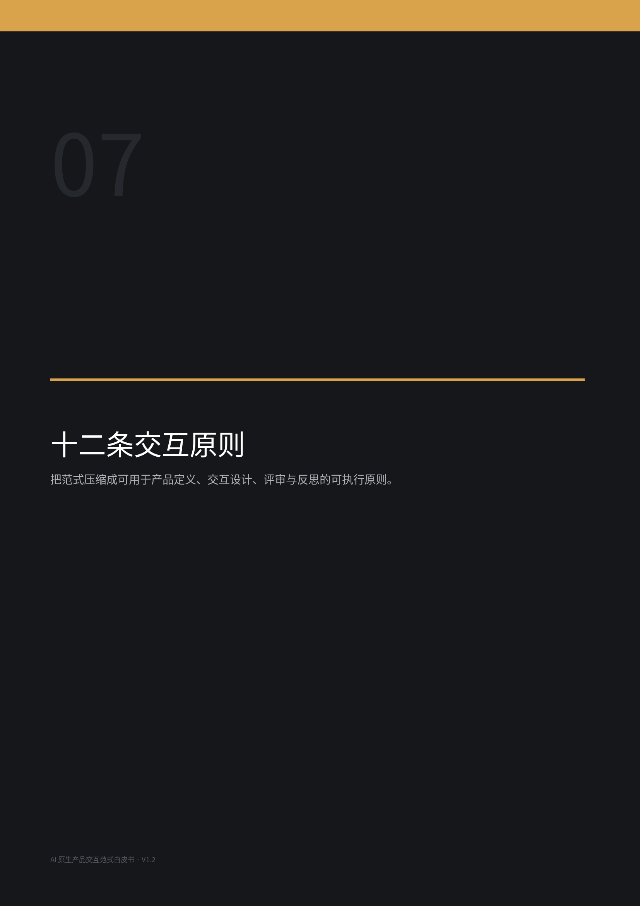

# 十二条 AI 原生产品交互原则

以下原则是对前文的压缩。它们不是 Checklist 式教条，而是一组可以用于产品定义、交互设计和评审的共同尺度。每一条都必须最终服务于第一律：降低不必要的认知负担，或提高可达到的结果上限。

<table>
<colgroup>
<col style="width: 16%" />
<col style="width: 83%" />
</colgroup>
<thead>
<tr class="header">
<th><strong>01</strong></th>
<th><strong>价值与目标优先 
先确定为什么和要什么，再决定怎么做。  为什么：</strong>避免路径、技术和功能反向绑架真正目标。 
<strong>反模式：</strong>一上来问技术栈、页面或功能，把实现方式当需求。</th>
</tr>
</thead>
<tbody>
</tbody>
</table>

<table>
<colgroup>
<col style="width: 16%" />
<col style="width: 83%" />
</colgroup>
<thead>
<tr class="header">
<th><strong>02</strong></th>
<th><strong>决策归属 
问题交给真正拥有答案的人。  为什么：</strong>用户负责价值、场景、偏好与权衡；AI 负责专业推理与实现。 
<strong>反模式：</strong>用“自由选择”包装 AI 不愿承担的专业判断。</th>
</tr>
</thead>
<tbody>
</tbody>
</table>

<table>
<colgroup>
<col style="width: 16%" />
<col style="width: 83%" />
</colgroup>
<thead>
<tr class="header">
<th><strong>03</strong></th>
<th><strong>选择必要性 
用户选择是一种稀缺资源。  为什么：</strong>只在不存在明确专业最优、且差异涉及用户价值时要求选择。 
<strong>反模式：</strong>因为有三个可行方案，就把三个按钮都丢给用户。</th>
</tr>
</thead>
<tbody>
</tbody>
</table>

<table>
<colgroup>
<col style="width: 16%" />
<col style="width: 83%" />
</colgroup>
<thead>
<tr class="header">
<th><strong>04</strong></th>
<th><strong>引导式意图显化 
把能感知却难表达的东西，转译成可执行意图。  为什么：</strong>通过比较、排除、示例、可视化和少量描述降低表达门槛。 
<strong>反模式：</strong>要求普通用户写专业
Prompt、参数表或完整需求文档。</th>
</tr>
</thead>
<tbody>
</tbody>
</table>

<table>
<colgroup>
<col style="width: 16%" />
<col style="width: 83%" />
</colgroup>
<thead>
<tr class="header">
<th><strong>05</strong></th>
<th><strong>专业框架驱动 
真正专业的 AI 会问对问题，而不是要求用户给专业答案。  为什么：</strong>持续调用当前最佳人类经验，动态决定下一次最有信息价值的交互。 
<strong>反模式：</strong>固定问卷、机械
Wizard、问题顺序与用户反馈无关。</th>
</tr>
</thead>
<tbody>
</tbody>
</table>

<table>
<colgroup>
<col style="width: 16%" />
<col style="width: 83%" />
</colgroup>
<thead>
<tr class="header">
<th><strong>06</strong></th>
<th><strong>目标对齐 
能做对，就不要再问；准备执行前完成目标确认。  为什么：</strong>收敛终点是可执行精度与用户确认，而非信息完整。 
<strong>反模式：</strong>为了“保险”反复确认已经不影响结果的变量。</th>
</tr>
</thead>
<tbody>
</tbody>
</table>

<table>
<colgroup>
<col style="width: 16%" />
<col style="width: 83%" />
</colgroup>
<thead>
<tr class="header">
<th><strong>07</strong></th>
<th><strong>判断流 
AI 持续执行，人只做高价值判断。  为什么：</strong>把用户从操作劳动中释放出来，同时保留价值主权。 
<strong>反模式：</strong>Agent
每一步都要用户批准，或用户完全失去理解权。</th>
</tr>
</thead>
<tbody>
</tbody>
</table>

<table>
<colgroup>
<col style="width: 16%" />
<col style="width: 83%" />
</colgroup>
<thead>
<tr class="header">
<th><strong>08</strong></th>
<th><strong>可观察自主 
执行权交给 AI，理解权留给用户。  为什么：</strong>工作流外显、状态可见、关键决策可追溯，但无需人工管理。 
<strong>反模式：</strong>黑箱执行到最后才交付，或把内部工作流全部变成用户任务。</th>
</tr>
</thead>
<tbody>
</tbody>
</table>

<table>
<colgroup>
<col style="width: 16%" />
<col style="width: 83%" />
</colgroup>
<thead>
<tr class="header">
<th><strong>09</strong></th>
<th><strong>预测 
预测创造更多选择权，而不是越权行动。  为什么：</strong>提前适配界面、准备资源与候选；执行由授权、成本和风险决定。 
<strong>反模式：</strong>为了展示“主动智能”而擅自付费、发布或产生外部承诺。</th>
</tr>
</thead>
<tbody>
</tbody>
</table>

<table>
<colgroup>
<col style="width: 16%" />
<col style="width: 83%" />
</colgroup>
<thead>
<tr class="header">
<th><strong>10</strong></th>
<th><strong>双向学习 
向内理解用户，向外理解世界。  为什么：</strong>用户模型和专业模型分别进化，并在行动层结合。 
<strong>反模式：</strong>把用户习惯当技术最优，或把一次偏好污染成通用知识。</th>
</tr>
</thead>
<tbody>
</tbody>
</table>

<table>
<colgroup>
<col style="width: 16%" />
<col style="width: 83%" />
</colgroup>
<thead>
<tr class="header">
<th><strong>11</strong></th>
<th><strong>偏好作用域 
信息的生命周期由语义决定。  为什么：</strong>区分人格、领域、项目和即时状态，按作用域继承与衰减。 
<strong>反模式：</strong>把所有记忆都永久化，或每次项目都从零开始。</th>
</tr>
</thead>
<tbody>
</tbody>
</table>

<table>
<colgroup>
<col style="width: 16%" />
<col style="width: 83%" />
</colgroup>
<thead>
<tr class="header">
<th><strong>12</strong></th>
<th><strong>持续超越 
历史偏好是先验，不是上限。  为什么：</strong>在理解用户的基础上，持续利用新知识提出更优可能。 
<strong>反模式：</strong>过度迎合过去，让个性化变成审美和能力的牢笼。</th>
</tr>
</thead>
<tbody>
</tbody>
</table>

# 08｜设计评审与反模式

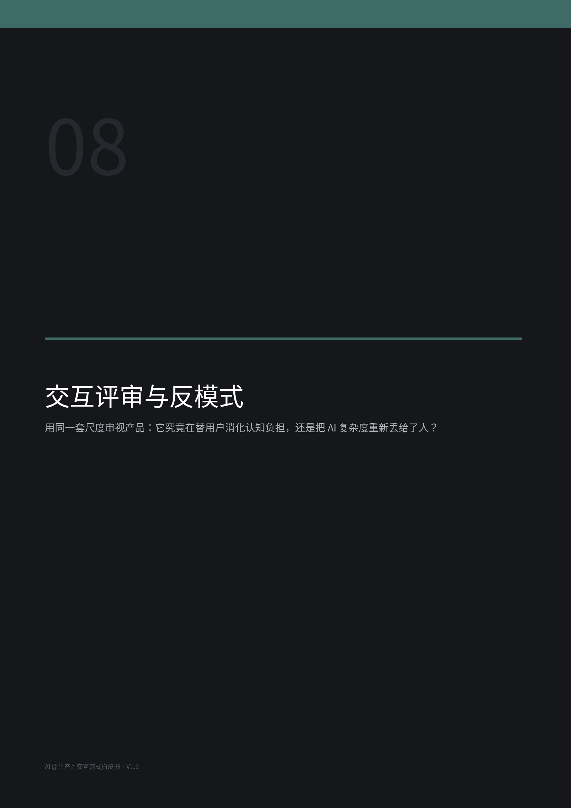

## 8.1 AI Native Interaction Review：十二问

任何使用 AI 能力并形成持续人—AI 交互闭环的数字产品，都可以用以下十二个问题进行交互评审。建议每项按 0 / 1 / 2 分记录：0 = 明显违背；1 = 部分满足；2 = 系统性满足。总分不是评级证书，而是帮助团队发现认知负担被错误转嫁的位置。

| **\#** | **设计审查问题**                                                     | **0 / 1 / 2** | **备注** |
|--------|----------------------------------------------------------------------|---------------|----------|
| 1      | 产品是否从元价值、目标、用户与场景开始，而不是从 AI 功能或页面开始？ |               |          |
| 2      | AI 是否把本应自己完成的专业判断重新丢给了用户？                      |               |          |
| 3      | 用户是否被要求用专业语言表达自己只能感知、难以描述的东西？           |               |          |
| 4      | 系统是否只在真正需要价值判断时要求用户选择？                         |               |          |
| 5      | 初始化是否由专业框架驱动，能帮助用户共同发现真正目标？               |               |          |
| 6      | AI 在开始自主执行前，是否把可执行目标外显并完成对齐？                |               |          |
| 7      | 工作流是否可观察、可理解，但无需用户亲自管理？                       |               |          |
| 8      | 用户是否主要参与高价值判断，而不是持续操作与配置？                   |               |          |
| 9      | 系统是否会预测下一步需求并提前准备，而非简单响应？                   |               |          |
| 10     | 系统是否能区分人格、领域、项目与即时偏好，并正确处理作用域？         |               |          |
| 11     | 产品是否持续吸收最新专业知识与能力，而不要求用户自己升级方法？       |               |          |
| 12     | 随着使用时间增长，必要交互是否下降，同时结果准确度和上限是否上升？   |               |          |

## 8.2 五类常见的反模式

<table>
<colgroup>
<col style="width: 100%" />
</colgroup>
<thead>
<tr class="header">
<th><strong>Prompt 依赖 
</strong>把表达精度责任交给用户；“会写 Prompt”成为产品使用门槛。</th>
</tr>
</thead>
<tbody>
</tbody>
</table>

<table>
<colgroup>
<col style="width: 100%" />
</colgroup>
<thead>
<tr class="header">
<th><strong>配置倾倒 
</strong>把模型、架构、参数和技术路径当作“可控性”全部暴露给用户。</th>
</tr>
</thead>
<tbody>
</tbody>
</table>

<table>
<colgroup>
<col style="width: 100%" />
</colgroup>
<thead>
<tr class="header">
<th><strong>选择泛滥 
</strong>系统不愿做判断，所有可行方案都交给用户选。</th>
</tr>
</thead>
<tbody>
</tbody>
</table>

<table>
<colgroup>
<col style="width: 100%" />
</colgroup>
<thead>
<tr class="header">
<th><strong>黑箱 Agent 
</strong>执行过程不可理解，直到结果出错才暴露偏差。</th>
</tr>
</thead>
<tbody>
</tbody>
</table>

<table>
<colgroup>
<col style="width: 100%" />
</colgroup>
<thead>
<tr class="header">
<th><strong>迎合式个性化 
</strong>把历史偏好当永久规则，产品越来越像过去的用户，而不是帮助他获得更好结果。</th>
</tr>
</thead>
<tbody>
</tbody>
</table>

## 8.3 两个重要边界

第一，AI 原生产品交互原则面向 AI 能力的长期方向，不应被当前模型的上下文长度、工具调用稳定性或推理错误率反向定义。当前能力不足应通过权限、验证、回滚、检查点和工程冗余解决。

第二，本白皮书的核心对象是具有持续人—AI 交互闭环的数字产品，并刻意不细化到不同数字产品品类。创作型 AI 产品与功能型 AI 产品在“更优”的定义、表达主权和专业判断边界上显然不同；智能硬件还会引入物理安全、空间交互与实时感知等额外约束。V1 系列的目标是建立核心律法与通用交互原则，而不是建立完整分类学。

# 前人的肩膀：这套范式与既有思想的关系

为了避免把跨界重构误写成“凭空原创”，本白皮书主动标注几条重要的思想前史。它们证明很多局部机制早已存在，也反过来说明：AI 原生产品交互范式需要的不是再发明一个孤立术语，而是把这些先进但碎片化的能力重组为可指导实际产品的统一体系。

<table>
<colgroup>
<col style="width: 100%" />
</colgroup>
<thead>
<tr class="header">
<th><strong>Mixed-Initiative Interaction（1999） 
</strong>Eric Horvitz
提出人和计算机应在合适时机各自承担最擅长的部分，为“责任动态分配”提供了早期理论基础。[1]</th>
</tr>
</thead>
<tbody>
</tbody>
</table>

<table>
<colgroup>
<col style="width: 100%" />
</colgroup>
<thead>
<tr class="header">
<th><strong>Guidelines for Human-AI Interaction（2019） 
</strong>Microsoft Research 总结 18
条人机交互准则，覆盖上下文行动、纠错、解释、学习、长期适应等环节。[2]</th>
</tr>
</thead>
<tbody>
</tbody>
</table>

<table>
<colgroup>
<col style="width: 100%" />
</colgroup>
<thead>
<tr class="header">
<th><strong>Preference Elicitation 
</strong>Google
等研究长期探索怎样用更少、更有信息价值的问题获取用户偏好；2025 年研究进一步训练 LLM 提出顺序性澄清问题。[8][9]</th>
</tr>
</thead>
<tbody>
</tbody>
</table>

<table>
<colgroup>
<col style="width: 100%" />
</colgroup>
<thead>
<tr class="header">
<th><strong>Visual Personalization 
</strong>ViPer、Midjourney Personalization 和 Stitch Fix 的 Latent Style
都说明：用户通过“喜欢/不喜欢/选择”表达偏好，常常比专业语言描述更高效。[3][4][5]</th>
</tr>
</thead>
<tbody>
</tbody>
</table>

<table>
<colgroup>
<col style="width: 100%" />
</colgroup>
<thead>
<tr class="header">
<th><strong>Preference-Guided Optimization（2026） 
</strong>APPO
让用户只提供二元偏好反馈，由算法在利用已知偏好和探索新方向之间动态平衡，并在实验中降低了手动改 Prompt 的认知负担。[6]</th>
</tr>
</thead>
<tbody>
</tbody>
</table>

<table>
<colgroup>
<col style="width: 100%" />
</colgroup>
<thead>
<tr class="header">
<th><strong>Generative Interfaces（2025–2026） 
</strong>最新研究正在从线性聊天转向任务相关动态界面，并提出设计师从“指定布局”转向“指定生成策略”的趋势。[7]</th>
</tr>
</thead>
<tbody>
</tbody>
</table>

本白皮书的主张，是把这些研究从“局部交互技巧”上升为完整的产品责任体系：目标与责任先于功能；用户价值判断与 AI 专业判断分层；引导式收敛负责显化意图；判断流与可观察自主负责长期协作；预测、学习和持续超越负责让产品不断成长。

# 结语｜AI 时代，让产品适应人，而不是让人适应产品

过去几十年的软件产品，默认用户需要学习系统：理解信息架构、记住功能入口、掌握参数、适应流程。即使移动互联网把操作变得更自然，人与软件的根本关系仍然没有被彻底改变。

AI 第一次提供了反转这种关系的可能：产品不再要求人不断适应它，而是让系统持续理解人、理解场景、理解目标，并把专业能力转化成越来越低摩擦的行动。

|     | **不该让用户学习如何使用你的 AI。而让 AI 在一次次高价值判断中，学习这个用户是谁、他真正想实现什么，以及怎样帮助他抵达过去未必能够抵达的地方。** |
|-----|-------------------------------------------------------------------------------------------------------------------------------------------------|

这并不意味着把人的主权交给机器。恰恰相反：AI 原生产品通过接管大量专业推理与操作，把人的注意力重新集中到价值、意图、判断、选择与创造上。人负责决定“什么值得”，AI 负责把它尽可能好地实现。

如果未来的产品仍然要求用户面对更多参数、更多技术选择、更多仪表盘和更多 Prompt，它只是在用新技术延续旧范式。真正的 AI 原生设计，应当让产品越强大，用户反而越轻松；让产品越了解用户，交互反而越少；让专业能力越复杂，用户越不需要先成为专家。

<table>
<colgroup>
<col style="width: 50%" />
<col style="width: 50%" />
</colgroup>
<thead>
<tr class="header">
<th></th>
<th><strong>第一律，再一次 
更低的认知负担，更高的结果上限。</strong></th>
</tr>
</thead>
<tbody>
</tbody>
</table>

# 参考文献与延伸阅读

[1] Horvitz, Eric. “Mixed-Initiative Interaction.” IEEE Intelligent Systems, 1999. [链接](https://www.microsoft.com/en-us/research/publication/mixed-initiative-interaction/)

[2] Amershi, Saleema, et al. “Guidelines for Human-AI Interaction.” CHI 2019. [链接](https://www.microsoft.com/en-us/research/publication/guidelines-for-human-ai-interaction/)

[3] Salehi, Sogand, et al. “ViPer: Visual Personalization of Generative Models via Individual Preference Learning.” ECCV 2024. [链接](https://viper.epfl.ch/)

[4] Midjourney. “Personalization.” Product Documentation, accessed 2026. [链接](https://docs.midjourney.com/hc/en-us/articles/32433330574221-Personalization)

[5] Stitch Fix. “10 Billion Interactions (and counting!) on Style Shuffle.” 2022. [链接](https://newsroom.stitchfix.com/blog/10-billion-interactions-and-counting-on-style-shuffle-the-data-powering-your-personalized-shopping-experience/)

[6] Li, Zhipeng; Liao, Yi-Chi; Holz, Christian. “Preference-Guided Prompt Optimization for Text-to-Image Generation.” arXiv, 2026. [链接](https://arxiv.org/abs/2602.13131)

[7] Chen, Jiaqi, et al. “Generative Interfaces for Language Models.” arXiv, 2025. [链接](https://arxiv.org/abs/2508.19227)

[8] Montazer, Ali, et al. “Asking Clarifying Questions for Preference Elicitation with Large Language Models.” Google Research, 2025. [链接](https://research.google/pubs/asking-clarifying-questions-for-preference-elicitation-with-large-language-models/)

[9] Martin, Carlos, et al. “Model-Free Preference Elicitation.” IJCAI 2024. [链接](https://research.google/pubs/model-free-preference-elicitation/)

[10] Kostric, Ivica; Balog, Krisztian; Radlinski, Filip. “Soliciting User Preferences in Conversational Recommender Systems via Usage-related Questions.” RecSys 2021. [链接](https://research.google/pubs/soliciting-user-preferences-in-conversational-recommender-systems-via-usage-related-questions/)

<table>
<colgroup>
<col style="width: 100%" />
</colgroup>
<thead>
<tr class="header">
<th><strong>开放方法论声明 
</strong>本白皮书意在提出一套可传播、可验证、可被继续改造的 AI
原生产品交互范式。它欢迎不同领域的产品团队使用、批判、验证与扩展。真正的价值不在于独占概念，而在于让更多产品减少用户无谓的认知负担，并把人的能力推向更高上限。</th>
</tr>
</thead>
<tbody>
</tbody>
</table>
